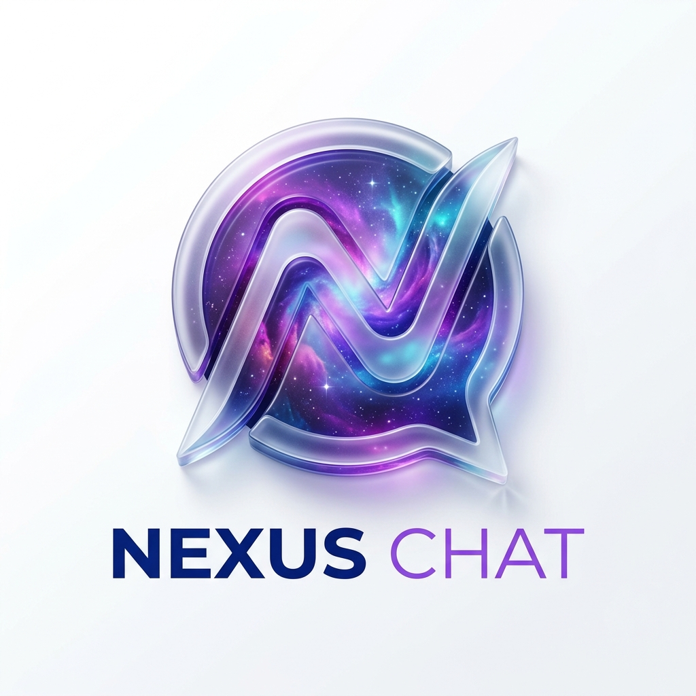

# <p align="center"><br>Nexus Chat</p>

[](https://vitejs.dev/)
[](https://reactjs.org/)
[](https://nodejs.org/)
[](https://www.postgresql.org/)
[](https://socket.io/)

Nexus Chat is a state-of-the-art, real-time messaging platform designed with a premium **Glassmorphism UI**. It offers a seamless communication experience with advanced features like multi-method authentication, AI-powered bot interactions, and comprehensive media management.

---

## ✨ Features

### 🔐 Advanced Authentication
*   **Multi-Method Login:** Support for Google OAuth, Email OTP, Phone OTP, and traditional Username/Password.
*   **Secure & Robust:** Password hashing with Bcrypt and stateless authentication using JWT.
*   **OTP Verification:** Time-based one-time passwords for enhanced security.

### 💬 Real-time Messaging
*   **Instant Delivery:** Powered by Socket.io for sub-millisecond message latency.
*   **Rich Interactions:** Emojis, message reactions, and threaded replies.
*   **Message Lifecycle:** Edit or delete messages with real-time updates for all participants.
*   **Typing Indicators:** See when others are typing in real-time.
*   **Read Receipts:** Track who has seen your messages.

### 🤖 Nexus Bot (AI Integration)
*   **Smart Commands:** Interact with the built-in bot using `@nexus`.
*   **Summarization:** Summarize recent room activity instantly.
*   **Translation:** Translate messages to different languages on the fly.
*   **Utilities:** Fetch weather and other real-time information.

### 📁 Media & Files
*   **Cloud Storage:** Integrated with **Cloudinary** for fast and reliable file hosting.
*   **Galleries:** Dedicated media galleries for each room to browse shared images, videos, and documents.
*   **Link Previews:** Automatic rich previews for shared URLs using Open Graph metadata.

### 📊 Room Management & Analytics
*   **Custom Rooms:** Create and manage different chat rooms with persistent membership.
*   **Live Statistics:** Real-time dashboard showing message trends, active members, and top contributors.
*   **Pinned Messages:** Keep important information at the top of the chat.

---

## 🛠️ Technology Stack

| Layer | Technologies |
| :--- | :--- |
| **Frontend** | React 19, Vite, Socket.io-client, Lucide Icons, Axios, Recharts, Zod |
| **Backend** | Node.js, Express, Socket.io, JWT, Multer, Nodemailer, OGS |
| **Database** | PostgreSQL |
| **Storage** | Cloudinary |
| **Auth** | Supabase, Google OAuth |
| **Styling** | Vanilla CSS (Glassmorphism & Dynamic Animations) |

---

## 🚀 Getting Started

### Prerequisites
*   Node.js (v18 or higher)
*   PostgreSQL database
*   Cloudinary Account (for file uploads)
*   Google Cloud Console Project (for OAuth)

### Installation

1.  **Clone the repository:**
    ```bash
    git clone https://github.com/Nexabug/nexus-chat.git
    cd nexus-chat
    ```

2.  **Setup Backend:**
    ```bash
    cd backend
    npm install
    ```
    Create a `.env` file in the `backend` directory:
    ```env
    DATABASE_URL=your_postgresql_url
    JWT_SECRET=your_jwt_secret
    CLOUDINARY_CLOUD_NAME=your_name
    CLOUDINARY_API_KEY=your_key
    CLOUDINARY_API_SECRET=your_secret
    EMAIL_USER=your_gmail
    EMAIL_PASS=your_app_password
    FRONTEND_URL=http://localhost:5173
    ```

3.  **Setup Frontend:**
    ```bash
    cd ../frontend
    npm install
    ```
    Create a `.env` file in the `frontend` directory:
    ```env
    VITE_API_URL=http://localhost:5000
    VITE_GOOGLE_CLIENT_ID=your_google_client_id
    VITE_SUPABASE_URL=your_supabase_url
    VITE_SUPABASE_ANON_KEY=your_supabase_key
    ```

### Running the App

1.  **Start the Backend Server:**
    ```bash
    cd backend
    node server.js
    ```

2.  **Start the Frontend Development Server:**
    ```bash
    cd frontend
    npm run dev
    ```

---

## 📁 Project Structure

```text
nexus-chat/
├── frontend/           # React frontend application
│   ├── src/
│   │   ├── components/ # UI Components (Chat, Login, Profile, etc.)
│   │   ├── assets/     # Static assets
│   │   └── App.jsx     # Main application component
├── backend/            # Node.js Express server
│   ├── server.js       # Main server and Socket.io logic
│   ├── database.js     # PostgreSQL schema and connection
│   └── uploads/        # Local upload cache
└── README.md           # Project documentation
```

---

## 🎨 UI/UX Design
Nexus Chat features a **Premium Design System**:
*   **Glassmorphism:** Frosted glass effects for a modern, depth-focused feel.
*   **Animated Backgrounds:** Dynamic blobs and gradients that breathe life into the UI.
*   **Responsive Layout:** Fully optimized for desktop and mobile experiences.
*   **Micro-interactions:** Smooth transitions and hover effects for a premium feel.

---

## 🤝 Contributing
Contributions are welcome! Please feel free to submit a Pull Request.

## 📄 License
This project is licensed under the ISC License.

---

<p align="center">Made with ❤️ by the Nexabug Team</p>
